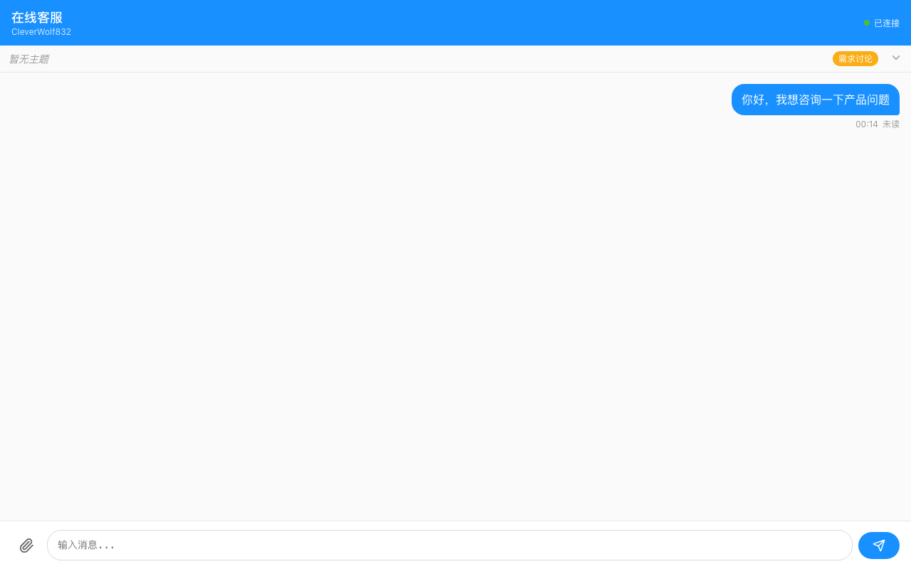
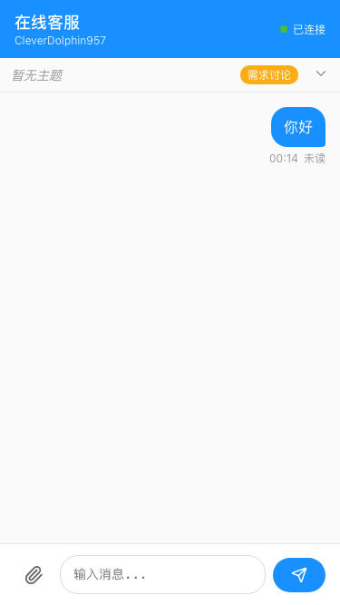
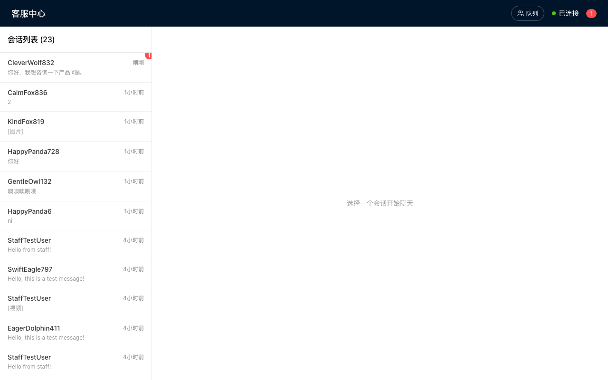
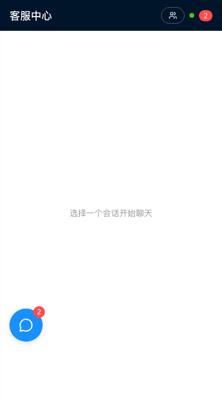

# 在线客服聊天系统

一个功能完整的企业级实时客服聊天系统，基于 React + Hono 构建，支持本地开发和 Cloudflare Workers 边缘部署。采用多租户架构，支持商家隔离，每个商家拥有独立的客服团队和聊天数据。

## 界面预览

### 用户端

| PC 端 | 移动端 |
|---|---|
|  |  |

### 客服端

| PC 端 | 移动端 |
|---|---|
|  |  |

## 🚀 一键部署

[](https://deploy.workers.cloudflare.com/?url=https://github.com/zunyuange/ZYG-online-chat)

> 部署后，在 Cloudflare 仪表盘中为 Worker 添加至少 32 字符的 `JWT_SECRET` 密钥。
> 如果未配置，页面顶部会显示黄色提醒并建议一个随机密钥，复制粘贴到 Secrets 即可。

---

## 功能特性

### 即时通讯
- **实时聊天** — SSE 实时消息推送 + 轮询备用，支持文本/图片/视频/文件消息
- **文件上传** — 支持图片（JPG/PNG/GIF/WebP）、视频（MP4/WebM）、文件（PDF/DOC/ZIP 等）上传，Cloudflare R2 存储
- **消息已读** — 消息已读/未读状态追踪

### 多租户架构
- **商家隔离** — 通过 `business_slug` 实现商家数据完全隔离
- **子账号管理** — 客服账号归属到特定商家，权限独立
- **自定义字段** — 访客端支持自定义字段（邮箱/电话/产品ID/自定义参数等）

### 排队系统
- **智能排队** — 按任务优先级自动排队，实时显示排队位置
- **等待时间估算** — 基于当前排队数量估算等待时间
- **优先级管理** — 支持队列优先级排序

### 任务进度管理
- **5 阶段任务流** — 需求讨论 → 需求确认 → 执行中 → 交付 → 评价
- **实时同步** — 客服切换任务状态后，用户端实时同步显示

### 智能翻译
- **6 级翻译引擎链** — 自动降级，无需任何 API Key，完全免费：

| 优先级 | 引擎 | 说明 |
|--------|------|------|
| ⭐ 第 0 级 | **Cloudflare Workers AI** | 内部 AI 绑定，零延迟，100+ 语言支持 |
| 🥇 第 1 级 | **PearApi 万能翻译** | 自动检测语言，精确翻译方向映射 |
| 🥈 第 2 级 | **SimplyTranslate AI** | 免费 RESTful，196+ 语言 |
| 🥉 第 3 级 | **Google Translate** | 免费稳定 |
| 🏅 第 4 级 | **MyMemory** | 免费后备，每日 1000-10000 词 |
| ⚡ 兜底 | **返回原文** | 所有引擎失败时降级 |

- **自动语言检测** — 基于 Unicode 字符集智能识别中/日/韩/英等语言
- **自动翻译** — 客服端可开启全自动翻译，消息自动翻译为目标语言
- **手动切换引擎** — 客服可手动选择不同翻译引擎重新翻译
- **HTML 保护** — 自动跳过含 HTML 标签的文本

### 客服转接
- **会话转接** — 客服之间可转接会话
- **转接历史** — 完整记录转接记录

### AI 机器人
- **关键词匹配** — 基于知识库的关键词自动回复
- **多语言知识库** — 支持按语言分类管理知识库

### FAQ 管理
- **常见问题** — 按语言分类的 FAQ 管理
- **快捷回复** — 客服常用语管理

### 评价系统
- **访客评分** — 会话结束后 1-5 分评价
- **评分统计** — 评分分布统计与可视化

### 安全防护
- **黑名单** — 访客黑名单管理，支持按 IP/访客 ID 封禁
- **敏感词过滤** — 违禁词检测与拦截
- **IP 限流** — 登录接口 5 次/10 分钟限流

### 推送通知
- **Bark 推送** — 支持 iOS 设备实时推送新消息通知

### 后台管理
- **商家管理** — 创建/编辑/删除商家
- **用户管理** — 客服账号 CRUD
- **角色权限** — RBAC 角色权限管理
- **系统设置** — 全局配置管理

### 多语言界面
- **20 种语言** — 简体中文/繁体中文/英语/日语/韩语/西班牙语/法语/意大利语/德语/葡萄牙语/越南语/俄语/印尼语/泰语/阿拉伯语/希腊语/波兰语/丹麦语/荷兰语/芬兰语
- **自动检测** — 浏览器语言自动匹配，URL 参数预设，用户手动切换
- **智能回复** — 支持数组类型的翻译值随机选取，增强对话自然度

### 响应式设计
- **全平台适配** — PC / 平板 / 移动端完美适配

---

## 技术栈

| 类别 | 技术 | 版本 |
|------|------|------|
| 前端框架 | React | ^19.1.0 |
| 状态管理 | Zustand | ^5.0.2 |
| 后端框架 | Hono | ^4.6.16 |
| 类型验证 | Zod | ^4.2.1 |
| 图标库 | Lucide React | ^0.575.0 |
| 数据库 | Cloudflare D1 (SQLite) | — |
| 文件存储 | Cloudflare R2 | — |
| AI 翻译 | Cloudflare Workers AI (`@cf/meta/m2m100-1.2b`) | — |
| 实时通信 | Server-Sent Events (SSE) + 轮询备用 | — |
| 认证 | JWT (HMAC-SHA256) | — |
| 推送通知 | Bark | — |
| 构建工具 | Vite | ^6.2.3 |
| 部署 | Cloudflare Workers / Wrangler | ^4.69.0 |
| 测试 | Vitest + Playwright | ^4.0.16 / ^1.50.0 |
| 代码规范 | ESLint + Prettier + Husky | — |

---

## 快速开始

### 环境要求

- **Node.js** >= 18.0.0
- **npm** >= 9.0.0

### 安装

```bash
npm install
```

### 本地开发

```bash
npm run dev
```

应用将在 http://localhost:3010 启动：

| 页面 | 地址 | 说明 |
|------|------|------|
| 用户端 | http://localhost:3010/chat | 访客聊天页面 |
| 客服端 | http://localhost:3010/staff | 客服工作台 |
| 客服登录 | http://localhost:3010/stafflogin | 客服登录页 |
| 管理后台 | http://localhost:3010/admin | 系统管理 |
| 管理员登录 | http://localhost:3010/adminlogin | 管理员登录 |

### 构建

```bash
npm run build
npm run preview     # 预览生产构建
```

### 测试

```bash
npm test                    # 运行所有测试
npm run test:unit           # 仅单元测试
npm run test:integration    # 仅集成测试
npm run test:e2e            # E2E 测试 (Playwright)
npm run test:ui             # 可视化测试界面
npm run coverage            # 测试覆盖率
```

### 代码质量

```bash
npm run lint                # ESLint 检查
npm run format              # Prettier 格式化
npm run typecheck           # TypeScript 类型检查
npm run validate:all        # 全量验证
```

---

## Cloudflare Workers 部署

### 前置要求

1. [Cloudflare 账号](https://dash.cloudflare.com/)
2. 安装 Wrangler CLI：`npm install -g wrangler`
3. 登录：`wrangler login`

### 创建资源

#### 1. 创建 D1 数据库

```bash
wrangler d1 create zyg-online-chat-db
```

将输出的 `database_id` 填入 `wrangler.toml`：

```toml
[[d1_databases]]
binding = "DB"
database_name = "zyg-online-chat-db"
database_id = "你的database_id"
```

#### 2. 创建 R2 存储桶

```bash
wrangler r2 bucket create zyg-online-chat-uploads
```

#### 3. 初始化数据库表

```bash
wrangler d1 execute zyg-online-chat-db --file=scripts/001_init.sql --remote
```

### 配置密钥

```bash
# JWT 签名密钥（必需，至少 32 字符）
wrangler secret put JWT_SECRET

# Bark 推送密钥（可选）
wrangler secret put BARK_KEY
```

### 部署

```bash
npm run deploy              # 部署到开发环境
npm run deploy:prod         # 部署到生产环境
```

### GitHub Actions 自动部署

在 GitHub 仓库 Secrets 中添加：

| Secret | 说明 |
|--------|------|
| `CLOUDFLARE_API_TOKEN` | Cloudflare API Token |
| `BARK_KEY` | Bark 推送密钥（可选） |

推送到 `main` 分支自动触发部署。

---

## 项目结构

```
ZYG-online-chat/
├── src/
│   ├── client/                     # React 前端
│   │   ├── App.tsx                 # 根组件（路由入口）
│   │   ├── main.tsx                # React 入口
│   │   ├── components/             # UI 组件
│   │   │   ├── chat/               # 用户端聊天组件
│   │   │   ├── staff/              # 客服端工作台组件
│   │   │   └── ui/                 # 通用 UI 组件
│   │   ├── pages/                  # 页面组件
│   │   │   ├── ChatPage.tsx        # 访客聊天页
│   │   │   ├── StaffPage.tsx       # 客服工作台
│   │   │   ├── StaffLoginPage.tsx  # 客服登录
│   │   │   ├── AdminPage.tsx       # 管理后台
│   │   │   └── AdminLoginPage.tsx  # 管理员登录
│   │   ├── stores/                 # Zustand 状态管理
│   │   └── services/               # API 客户端
│   │
│   ├── server/                     # Hono 后端
│   │   ├── index.worker.ts         # Cloudflare Workers 入口
│   │   ├── index.node.ts           # Node.js 入口（本地开发）
│   │   ├── module-chat/            # 聊天模块（核心）
│   │   │   ├── routes/chat-routes.ts
│   │   │   └── services/
│   │   │       ├── chat-service.ts     # 会话/消息管理
│   │   │       ├── sse-service.ts      # SSE 实时推送
│   │   │       ├── queue-service.ts    # 排队系统
│   │   │       ├── transfer-service.ts # 客服转接
│   │   │       └── upload-service.ts   # 文件上传
│   │   ├── module-staff/           # 客服模块
│   │   ├── module-admin/           # 管理后台模块
│   │   ├── module-auth/            # 认证模块
│   │   ├── module-business/        # 商家/多租户模块
│   │   ├── module-robot/           # AI 机器人模块
│   │   ├── module-faq/             # FAQ 模块
│   │   ├── module-evaluation/      # 评价模块
│   │   ├── services/               # 跨模块服务
│   │   │   ├── translate-service.ts # 6 级翻译引擎链
│   │   │   └── bark-service.ts     # Bark 推送通知
│   │   └── shared/                 # 基础设施层
│   │       └── db.ts               # 数据库抽象层
│   │
│   └── shared/                     # 共享类型
│       ├── types.ts                # 核心类型定义
│       ├── schemas.ts              # Zod 验证模式
│       ├── rpc-server.ts           # Hono RPC 客户端
│       └── i18n/                   # 国际化
│           └── locales/            # 20 种语言文件
│
├── docs/                           # 文档
│   ├── USER_GUIDE.md               # 用户使用指南
│   ├── STAFF_GUIDE.md              # 客服操作指南
│   ├── INTERACTION.md              # 交互流程文档
│   └── CLOUDFLARE_WORKERS_DEPLOYMENT.md  # 部署详细指南
├── scripts/                        # 脚本工具
│   ├── 001_init.sql                # 数据库初始化 SQL
│   └── validate-all.ts             # 全量验证脚本
├── wrangler.toml                   # Cloudflare Workers 配置
├── vite.config.ts                  # Vite 构建配置
├── tsconfig.json                   # TypeScript 配置
└── package.json                    # 项目依赖
```

---

## 路径别名

| 别名 | 映射路径 |
|------|----------|
| `@shared/*` | `src/shared/*` |
| `@client/*` | `src/client/*` |
| `@server/*` | `src/server/*` |

---

## 核心功能详解

### 翻译引擎链

自动翻译是系统的亮点功能，实现了 6 级降级翻译：

1. **Cloudflare Workers AI** — 使用 `@cf/meta/m2m100-1.2b` 模型，通过内部 AI binding 直连，零延迟，支持 100+ 语言
2. **PearApi 万能翻译** — 自动检测源语言 + 精确翻译方向映射，支持 20 种语言
3. **SimplyTranslate AI** — 免费 RESTful API，196+ 语言，100 次/分钟
4. **Google Translate** — 免费稳定，全球覆盖
5. **MyMemory** — 免费后备方案，每日 1000-10000 词
6. **返回原文** — 所有引擎失败时降级，保证消息不丢失

翻译流程包含：
- 智能语言检测（基于 Unicode 字符集比例阈值）
- HTML 标签自动保护
- 目标语言匹配检测（避免重复翻译）
- 客服手动切换引擎重新翻译
- 全自动翻译模式（客服端实时自动翻译所有消息）

### 多语言界面

系统界面已翻译为 **20 种语言**，支持：
- 浏览器语言自动匹配
- URL 参数预设语言（`?lang=ja`）
- localStorage 记忆用户选择
- 随机回复（数组值随机选取）

### 多租户隔离

通过商家标识（`business_slug`）实现完整数据隔离：
- 商家主账号拥有完整管理权限
- 客服子账号归属到特定商家
- 会话/消息/排队/统计数据按商家隔离
- 客服嵌入代码支持按商家生成

### 5 阶段任务流

```
需求讨论 → 需求确认 → 执行中 → 交付 → 评价
```

客服可在工作台点击任务状态切换，用户端实时同步展示进度。

---

## 环境变量

参考 `wrangler.toml` 中的 `[vars]` 配置：

| 变量 | 说明 | 必需 |
|------|------|------|
| `JWT_SECRET` | JWT 签名密钥（至少 32 字符） | ✅ 必需 |
| `BARK_API` | Bark 推送 API 地址 | ❌ 可选 |
| `BARK_KEY` | Bark 推送密钥 | ❌ 可选 |
| `STAFF_URL_BASE` | 客服端完整 URL（用于推送链接） | ❌ 可选 |
| `REQUIRE_AUTH` | 是否要求客服登录（`"true"` / `"false"`） | ❌ 可选 |

---

## 文档

- [用户使用指南](./docs/USER_GUIDE.md)
- [客服操作指南](./docs/STAFF_GUIDE.md)
- [交互流程文档](./docs/INTERACTION.md)
- [Cloudflare Workers 部署指南](./docs/CLOUDFLARE_WORKERS_DEPLOYMENT.md)
- [设计文档](./DESIGN.md)

---

## 开发规范

### Git 工作流

- 使用 Husky 预提交钩子
- 提交前自动运行 lint-staged（Prettier + ESLint）
- 禁止跳过钩子提交

### 模块化架构

每个后端模块遵循统一结构：

```
module-{feature}/
├── routes/         # API 路由（Hono RPC）
├── services/       # 业务逻辑层
└── __tests__/      # 单元测试
```

### 测试策略

| 类型 | 框架 | 环境 | 覆盖范围 |
|------|------|------|----------|
| 单元测试 | Vitest | jsdom / node | Services, Stores, Utils |
| 集成测试 | Vitest | node | API Endpoints |
| E2E 测试 | Playwright | Browser | User Workflows |

---

## License

MIT
